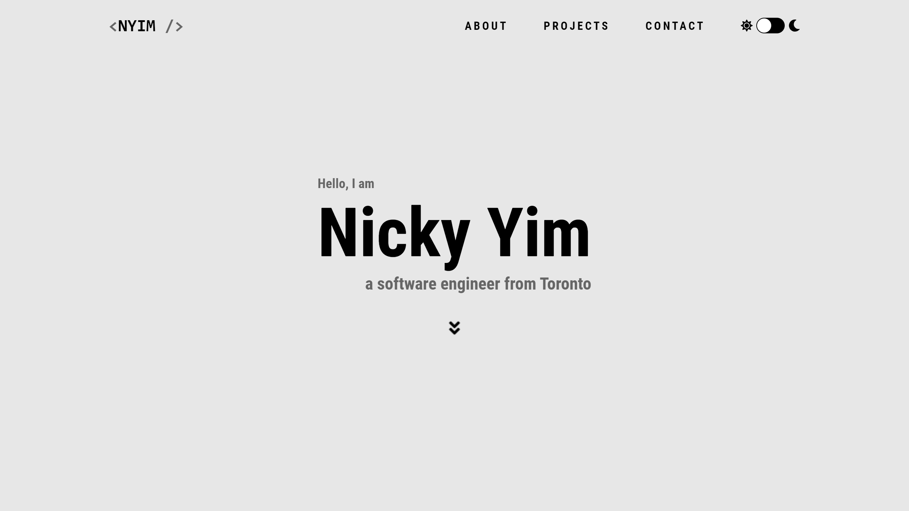
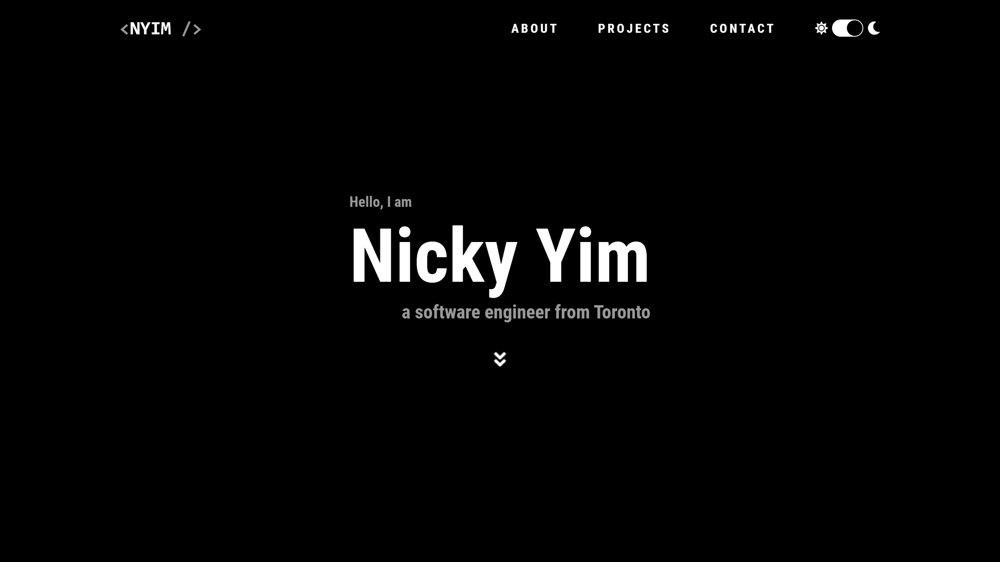
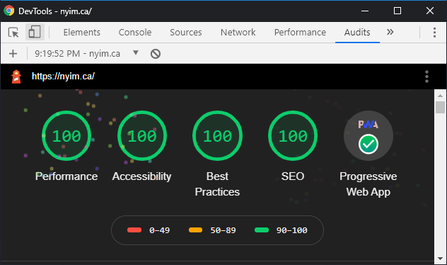

  

  

<h1 align="center">
  NYIM.ca
</h1>

  Nicky's single-page <a alt="NYIM.ca" href="https://nyim.ca" target="_blank">personal website</a> handcrafted with <a alt="Gatsby" href="https://gatsbyjs.org" target="_blank">Gatsby</a> and hosted with <a alt="Netlify" href="https://netlify.com" target="_blank">Netlify</a>.

 

# Features
- Source cover and bio text from markdown files
- Source GitHub repos using `gatsby-plugin-graphql`
- Optimized external images (in this case, GitHub repo social preview images) using `gatsby-images`
- Contact form using [Netlify Forms](https://www.netlify.com/products/forms/)
- Toggle switch for light/dark mode
- Font Awesome icons with `react-icons`

# Performance
Thanks to [Gatsby](https://gatsbyjs.org)'s features, this site achieves a 100% Lighthouse audit score!

